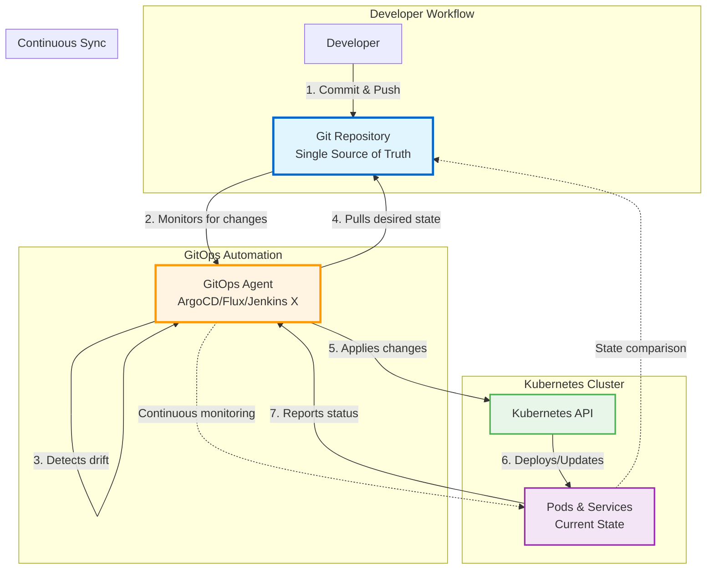

# Week 2 Reflection – GitOps with FluxCD

This week, I set up GitOps in my cluster using **FluxCD**. I bootstrapped my own repository, created a Git source and a Kustomization, and learned how declarative workflows can automate and standardize Kubernetes operations.

---

## ✅ What I Learned

### What is GitOps?

GitOps is a deployment model that uses Git as the single source of truth for declarative infrastructure and applications. Changes to the desired state are made in Git, and automated processes ensure that the actual state in the cluster matches the desired state.

### Core principles of GitOps

1. Declarative Descriptions
2. Versioned and Immutable Storage
3. Automated Delivery
4. Automatic drift detection and correction

### Benefits of GitOps

- Improved collaboration and transparency
- Enhanced security and compliance
- Faster and more reliable deployments
- Faster recovery and rollbacks

### GitOps Pull-based model

In a pull-based model, the GitOps operator (like FluxCD) continuously monitors the Git repository for changes. When a change is detected, the operator pulls the new configuration and applies it to the cluster. This approach allows for better security and scalability, as the operator can run with limited permissions and does not require direct access to the cluster from external systems.



## Installing FluxCD

I installed FluxCD using the CLI and bootstrapped my GitHub repository. This process set up all necessary components in my cluster and connected it to my Git repository.

```bash
flux bootstrap github \
  --owner=rmiravalles \
  --repository=grow \
  --branch=main \
  --path=./clusters/grow \
  --personal
```

---

## ❓ What Was Challenging

-
- 
- 
- 


---

## 🧪 Commands I Practiced

```bash


```

---

## 🔁 GitOps Impact

- 
- 
- 
- 


---

## 📝 Questions I Still Have

- 
- 
- 
-


---

## 📎 Related Files

- `clusters/dev/kustomization.yaml`
- `.flux.yaml` (if applicable)
- GitHub repository path and bootstrap settings

---

## 🚀 Looking Ahead

I’m curious to explore how GitOps handles secrets, multi-cluster environments, and policy-based validations using tools like SOPS, Kyverno, or Vault.

