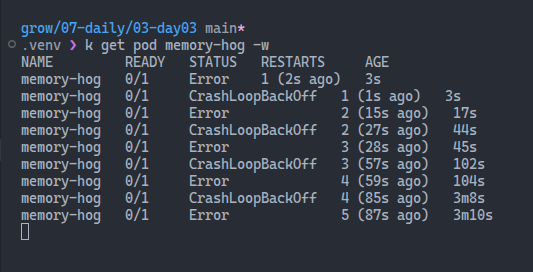
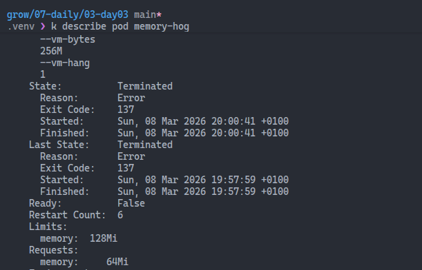

# Requests, limits and QoS

In Kubernetes, you can specify resource requests and limits for your containers to ensure that they have the necessary resources to run effectively while preventing them from consuming too much of the cluster's resources.

[Quality of Service (QoS) classes](https://kubernetes.io/docs/concepts/workloads/pods/pod-qos/) are assigned to Pods based on the resource requests and limits defined for their containers. The QoS class determines the priority of the Pod when it comes to scheduling and eviction under resource pressure.

## Exceeding memory limits

In the Pod below, we have a container that uses the `polinux/stress` image to create memory pressure. The container is configured with a memory request of `64Mi` and a memory limit of `128Mi`. The stress command tries to allocate `256M` of memory, causing an OOM (Out Of Memory) kill.

```yaml
apiVersion: v1
kind: Pod
metadata:
  name: memory-hog
spec:
  containers:
  - name: stress
    image: polinux/stress
    resources:
      limits:
        memory: "128Mi"
      requests:
        memory: "64Mi"
    command: ["stress"]
    args: ["--vm", "1", "--vm-bytes", "256M", "--vm-hang", "1"]
```

The Pod will stay in a `CrashLoopBackOff` state because the container is repeatedly killed due to exceeding the memory limit.



```bash
kubectl describe pod memory-hog
```

The Pod's last state shows that it was terminated with exit code `137`.



Exit code 137 means the process was killed by SIGKILL (128 + 9 = 137).

In Kubernetes, this most often indicates an OOM kill:

- The container exceeded its memory limit.
- The kernel force-killed the process.
- Kubelet then restarts it, often leading to CrashLoopBackOff.

## What is an OOM kill?

OOM means "Out Of Memory". An OOM kill happens when a process tries to use more memory than is available under its memory boundary. In Kubernetes, the most common case is a container crossing its configured memory limit. The Linux kernel OOM logic terminates the process to protect node stability.

Common signs:

- Container exits with code `137` (SIGKILL)
- Pod events show restarts and `BackOff`
- Pod enters `CrashLoopBackOff` when the process is repeatedly killed

When it happens:

- The container memory working set grows beyond `resources.limits.memory`
- The application has a memory leak or temporary memory spike
- The limit is too low for normal workload behavior

Important detail:

- `requests.memory` influences scheduling decisions.
- `limits.memory` is the hard enforcement boundary for runtime memory usage.

## Installing Metrics Server

To monitor resource usage and troubleshoot issues like OOM kills, you can install the [Metrics Server](https://github.com/kubernetes-sigs/metrics-server/) in your cluster. The Metrics Server collects resource metrics from the kubelet and exposes them via the Kubernetes API. It wasn't installed by default in my Kind cluster. When I ran `kubectl top pod memory-hog`, I got an error saying that the metrics API was not available.

To install the Metrics Server, I ran the following commands:

```bash
# Install the latest version of Metrics Server
kubectl apply -f https://github.com/kubernetes-sigs/metrics-server/releases/latest/download/components.yaml

# Patch the deployment
kubectl -n kube-system patch deployment metrics-server \
  --type='json' \
  -p='[
    {"op":"add","path":"/spec/template/spec/containers/0/args/-","value":"--kubelet-insecure-tls"},
    {"op":"add","path":"/spec/template/spec/containers/0/args/-","value":"--kubelet-preferred-address-types=InternalIP,Hostname,InternalDNS,ExternalDNS,ExternalIP"}
  ]'
```

Verify the installation and check metrics:

```bash
kubectl -n kube-system rollout status deploy/metrics-server
kubectl get apiservice v1beta1.metrics.k8s.io
kubectl top nodes
kubectl top pods
```

## Guaranteed QoS Pod

A Pod is classified as Guaranteed QoS if:

- Every container in the Pod has memory and CPU limits set.
- The memory and CPU limits are equal to the requests.

This means that the Pod has a guaranteed amount of resources and will not be evicted under resource pressure.

```yml
apiVersion: v1
kind: Pod
metadata:
  name: memory-guaranteed
spec:
  containers:
  - name: stress
    image: polinux/stress
    resources:
      requests:
        memory: "128Mi"
        cpu: "100m"
      limits:
        memory: "128Mi"
        cpu: "100m"
    command: ["stress"]
    args: ["--vm", "1", "--vm-bytes", "100M", "--vm-hang", "1"]
```

```bash
kubectl get pod memory-guaranteed -o jsonpath='{.status.qosClass}'
```

## Best effort QoS Pod

A Pod is classified as Best Effort QoS if:

- The Pod does not have any resource requests or limits defined for any of its containers, and it does not have any resource requests or limits defined at the Pod level.

```yaml
apiVersion: v1
kind: Pod
metadata:
  name: memory-besteffort
spec:
  containers:
  - name: stress
    image: polinux/stress
    command: ["stress"]
    args: ["--vm", "1", "--vm-bytes", "100M", "--vm-hang", "1"]
```

```bash
kubectl get pod memory-besteffort -o jsonpath='{.status.qosClass}'
```

## Burstable QoS Pod

A Pod is classified as Burstable QoS if:

- The Pod has at least one container with resource requests and limits defined, but not all containers have the same requests and limits, or some containers have requests and limits while others do not.

> When memory is tight, eviction order is: BestEffort → Burstable (exceeding requests) → Guaranteed (last resort).

## Production tips

Set both requests and limits for predictable behavior:

```yml
resources:
  requests:
    memory: "256Mi"
    cpu: "200m"
  limits:
    memory: "512Mi"
    cpu: "500m"
```

For burstable web workloads, use low requests and higher limits. For consistent services (databases), keep requests == limits to stay in Guaranteed QoS.


