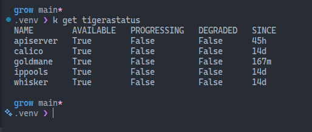

## Network policies

Network policies are a Kubernetes resource that allow you to control the flow of traffic between Pods and other network endpoints. They are implemented by the cluster's network plugin (like Calico) and provide a way to enforce security and segmentation within the cluster.

## CNI

CNI (Container Network Interface) is a specification for configuring network interfaces in Linux containers. Kubernetes uses CNI plugins to manage the network connectivity of Pods. To use network policies, you need to have a CNI plugin that supports them. Calico is a popular choice for Kubernetes clusters.

## Install Calico

Resource: [Calico Quick Start Guide](https://docs.tigera.io/calico/latest/getting-started/kubernetes/quickstart)

```bash
# Install the Tigera operator and CRDs
kubectl create -f https://raw.githubusercontent.com/projectcalico/calico/v3.31.3/manifests/tigera-operator.yaml

# Install Calico components and custom resources
kubectl create -f https://raw.githubusercontent.com/projectcalico/calico/v3.31.3/manifests/custom-resources.yaml

# Monitor the installation
watch kubectl get tigerastatus
```

I had an issue with the installation, and I had to fix it by patching the default Calico Installation IPPool CIDR to match the cluster pod CIDR.

## Tigera degraded fix (what changed and why)

After installation, `kubectl get tigerastatus` showed all components as `DEGRADED=True`.

### Root cause identified

- `Installation/default` had an IPPool CIDR of `192.168.0.0/16`.
- The Kind cluster pod network was `10.244.0.0/16`.
- Tigera operator reported: IPPool was not within the platform configured pod network CIDR.

The IPPool value was read directly from the live cluster `Installation` resource:

```bash
kubectl get installation default -o yaml
```
Look for `ipPools`, and `cidr`.

Field path used:

```text
spec.calicoNetwork.ipPools[].cidr
```

Quick command to print only the CIDR value:

```bash
kubectl get installation default -o jsonpath='{.spec.calicoNetwork.ipPools[*].cidr}{"\n"}'
```

This mismatch prevented IP pool creation, which cascaded into other components (`apiserver`, `goldmane`, `whisker`) failing because `calico-system` resources could not be reconciled.

### Change applied

I patched the default Calico Installation IPPool CIDR to match the cluster pod CIDR:

```bash
kubectl patch installation default --type merge -p '{"spec":{"calicoNetwork":{"ipPools":[{"name":"default-ipv4-ippool","cidr":"10.244.0.0/16","blockSize":26,"encapsulation":"VXLANCrossSubnet","natOutgoing":"Enabled","nodeSelector":"all()"}]}}}'
```

### Verification

Verified successful recovery with:

```bash
kubectl get tigerastatus
kubectl get installation default -o yaml
```

All Tigera components now show `AVAILABLE=True`, `PROGRESSING=False`, `DEGRADED=False`.



### Pre-flight check for future installs

Before (or immediately after) applying Tigera manifests, validate that the cluster pod CIDR and Calico IPPool CIDR match.

```bash
# 1) Check cluster pod CIDRs
kubectl get nodes -o jsonpath='{range .items[*]}{.metadata.name}{" podCIDR="}{.spec.podCIDR}{"\n"}{end}'

# 2) Check configured Calico IPPool CIDR
kubectl get installation default -o jsonpath='{.spec.calicoNetwork.ipPools[*].cidr}{"\n"}'

# 3) If they differ, patch Installation to the cluster pod CIDR (example: 10.244.0.0/16)
kubectl patch installation default --type merge -p '{"spec":{"calicoNetwork":{"ipPools":[{"name":"default-ipv4-ippool","cidr":"10.244.0.0/16","blockSize":26,"encapsulation":"VXLANCrossSubnet","natOutgoing":"Enabled","nodeSelector":"all()"}]}}}'

# 4) Confirm recovery
kubectl get tigerastatus
```

## Monitor network traffic in Calico Whisker

Calico Whisker is a tool that provides visibility into network traffic in a Calico-enabled Kubernetes cluster. It allows you to see which Pods are communicating with each other and what protocols they are using.

```bash
kubectl port-forward -n calico-system service/whisker 8081:8081
```

After running the above command, you can access the Whisker UI by navigating to `http://localhost:8081` in your web browser.

I could see the UI, but it was empty with no traffic. I had to troubleshoot and fix an installation issue before I could see traffic in Whisker. Below is the troubleshooting process I followed to resolve the issue and get Whisker working.

### Whisker shows no traffic (quick troubleshooting)

If the UI opens but stays empty, verify these in order:

```bash
# 1) Core components must be healthy
kubectl get tigerastatus
kubectl get pods -n calico-system

# 2) Check Whisker backend errors (look for DNS timeout to goldmane)
kubectl logs -n calico-system deploy/whisker -c whisker-backend --tail=100

# 3) Validate DNS rule selector used by Whisker NetworkPolicy
kubectl get netpol -n calico-system whisker -o yaml
kubectl get ns kube-system --show-labels
```

If logs contain errors like
`lookup goldmane.calico-system.svc.cluster.local on <dns-ip>:53: i/o timeout`,
the Whisker Pod can be blocked from DNS by a namespace label mismatch.

```bash
# Fix: add the expected label used by the Whisker DNS egress policy
kubectl label ns kube-system projectcalico.org/name=kube-system --overwrite

# Re-check backend logs for recovery
kubectl logs -n calico-system deploy/whisker -c whisker-backend --tail=50
```

After that, generate in-cluster traffic (for example `client -> web`) and refresh Whisker.


## The exercise

### Deploy two communicating Pods

```bash
# web server
kubectl run web --image=nginx --labels="app=web" --port=80

# client
kubectl run client --image=busybox --labels="app=client" --command -- sleep 3600
```

### Direct Pod-to-Pod connectivity test

```bash
WEB_IP=$(kubectl get pod web -o jsonpath='{.status.podIP}')
kubectl exec client -- wget -qO- --timeout=2 "http://$WEB_IP"
```

Breaking the command down:

`WEB_IP=$(kubectl get pod web -o jsonpath='{.status.podIP}')`

- Runs `kubectl get pod web` and extracts only the web Pod IP (`status.podIP`) using JSONPath.
- Stores that IP in the shell variable `WEB_IP`.
  
`kubectl exec client -- wget -qO- --timeout=2 "http://$WEB_IP"`

- Executes a command inside the `client` Pod.
- Inside `client`, it runs `wget` against the `web` Pod IP over HTTP.
- `-q` = quiet output, `-O-` = print response body to stdout, `--timeout=2` = fail quickly after 2 seconds.
If it returns HTML (like nginx default page), connectivity is working.
If it times out or errors, the `client` Pod cannot reach `web` on port 80 (or `web` is not ready).

### Expose web server with a Service and test connectivity

```bash
kubectl expose pod web --name web --port 80 --target-port 80
kubectl get svc web
kubectl exec client -- wget -qO- --timeout=2 http://web
```

This method is preferred because it tests connectivity the way real Kubernetes apps communicate: through a Service name, not a Pod IP.

Key reasons:

- **Pod IPs are ephemeral**. Pods get recreated often, and their IP can change. A Service gives a stable virtual IP and DNS name.
- **Built-in load balancing**. A Service can route to multiple backend Pods automatically. Testing via Service validates that layer too.
- **More realistic app behavior**. Most workloads call `http://service-name` in-cluster. Verifying that path checks DNS + Service + endpoints, which is closer to production behavior.
- **Better for scaling and rolling updates**. When Pods are replaced during updates, Service routing keeps working without clients needing to track new Pod IPs.

> Direct Pod-IP testing is still useful for low-level debugging, but Service-based testing is the correct default for normal app communication.

### Network policy lockout

```YAML
apiVersion: networking.k8s.io/v1
kind: NetworkPolicy
metadata:
  name: default-deny-all
spec:
  podSelector: {}
  policyTypes:
  - Ingress
  - Egress
```

This manifest creates a namespace-wide default deny policy.

What it does:

`podSelector: {}`
Selects all Pods in the namespace where this policy is applied.

`policyTypes: [Ingress, Egress]`
Tells Kubernetes to enforce both inbound and outbound traffic rules.

No `ingress` or `egress` rule blocks, because there are no allow rules, all ingress and all egress for selected Pods is **denied by default**.

Practical effect:

- Pods cannot receive traffic from other Pods/services.
- Pods cannot make outbound connections (including DNS) unless another NetworkPolicy explicitly allows it.
- Scope is only that namespace, not the whole cluster.
- So this file is a baseline **lock everything down first** policy.

After applying this policy, the `client` Pod will lose connectivity to `web` and any other external services.

This is the response when trying to access `web` from `client` after applying the default deny policy:

```bash
kubectl exec client -- wget -qO- --timeout=2 http://web
```

```Bash
wget: download timed out
command terminated with exit code 1
```

Resolving DNS will also fail:

```bash
kubectl exec client -- wget -qO- --timeout=2 http://kubernetes.default

# or with nslookup
kubectl exec client -- nslookup kubernetes.default
```

The response will be:

```bash
connection timed out; no servers could be reached
command terminated with exit code 1
```

DNS fails because the current policy denies all egress from client, and DNS requires egress.

What happens when client tries http://kubernetes.default:

- The Pod asks a DNS server (usually CoreDNS) to resolve `kubernetes.default`.
- That DNS query is outbound traffic from client to the DNS Service IP (typically `kube-dns` in `kube-system`) on port 53 (`UDP`, sometimes `TCP`).
- The default-deny-all policy has `policyTypes: [Ingress, Egress]` and no `egress` allow rules, so that DNS request is dropped.
- No DNS answer means name resolution fails.

Important nuance:

- NetworkPolicy is namespace-scoped, but it controls the selected Pod’s traffic to any destination, including other namespaces.
- So even though CoreDNS is in `kube-system`, your Pod still cannot reach it.

### Allowing DNS

```yml
apiVersion: networking.k8s.io/v1
kind: NetworkPolicy
metadata:
  name: allow-dns
spec:
  podSelector: {}
  policyTypes:
  - Egress
  egress:
  - to:
    - namespaceSelector:
        matchLabels:
          kubernetes.io/metadata.name: kube-system
    ports:
    - protocol: UDP
      port: 53
```

This policy allows all Pods in the namespace to send UDP traffic to port 53 on any Pod in the `kube-system` namespace. Reaching the `web` Pod will still fail because we haven't allowed that traffic yet.

### Allowing traffic to web

```yaml
apiVersion: networking.k8s.io/v1
kind: NetworkPolicy
metadata:
  name: allow-web-ingress
spec:
  podSelector:
    matchLabels:
      app: web
  policyTypes:
  - Ingress
  ingress:
  - from:
    - podSelector:
        matchLabels:
          app: client
    ports:
    - protocol: TCP
      port: 80
```

Still fails because the client cannot make egress connections yet.

### Allowing client egress to web

```yaml
apiVersion: networking.k8s.io/v1
kind: NetworkPolicy
metadata:
  name: allow-client-egress
spec:
  podSelector:
    matchLabels:
      app: client
  policyTypes:
  - Egress
  egress:
  - to:
    - podSelector:
        matchLabels:
          app: web
    ports:
    - protocol: TCP
      port: 80
  - to:
    - namespaceSelector:
        matchLabels:
          kubernetes.io/metadata.name: kube-system
    ports:
    - protocol: UDP
      port: 53
```

It works now because this policy re-opens the two outbound paths that `client` needs under a default-deny setup:

- Egress from `client` to `web` on TCP/80. This rule allows the actual HTTP traffic.
- Egress from `client` to DNS in `kube-system` on UDP/53. This rule allows name resolution for `http://web`.
- Without DNS egress, `wget http://web` would fail before even trying HTTP.

## Useful commands

```bash
# Check applied policies and their effects
kubectl get networkpolicy
kubectl describe networkpolicy allow-web-ingress
kubectl describe networkpolicy allow-client-egress
```


