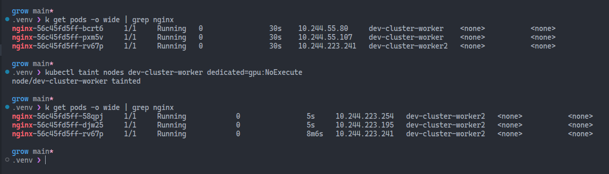
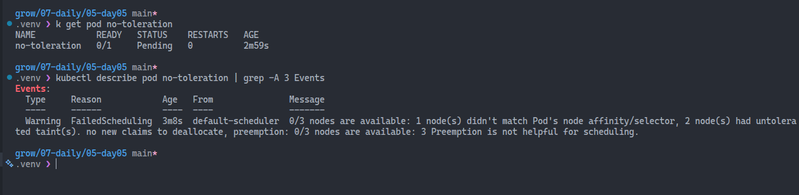

# Taints and Tolerations

Taints and tolerations are Kubernetes mechanisms that allow you to control which Pods can be scheduled on which Nodes. They are used to ensure that certain Pods are only scheduled on specific Nodes, or to prevent certain Pods from being scheduled on specific Nodes.

> Taints are applied to Nodes and allow you to mark a Node as unsuitable for certain Pods. Tolerations are applied to Pods and allow them to tolerate the taints on Nodes, meaning they can be scheduled on those Nodes despite the taints.

## Taint format

A taint consists of three parts:

- **Key**: A string that identifies the taint.
- **Value**: An optional string that provides additional information about the taint.
- **Effect**: The effect of the taint, which can be one of the following:
  - **NoSchedule**: Pods that do not tolerate this taint will not be scheduled on the Node.
  - **PreferNoSchedule**: Kubernetes will try to avoid scheduling Pods that do not tolerate this taint on the Node, but it is not guaranteed.
  - **NoExecute**: Pods that do not tolerate this taint will be evicted from the Node if they are already running, and new Pods that do not tolerate this taint will not be scheduled on the Node.
- **TolerationSeconds**: An optional field that specifies how long a Pod can tolerate a taint before it is evicted. *This is only applicable for NoExecute taints*.

## Tainting Nodes

To start with, let's create a deployment with 3 replicas and observe to which Nodes the Pods are scheduled:

```bash
# Create a deployment with 3 replicas
kubectl create deployment nginx --image=nginx --replicas=3

# Check the Pods and their assigned Nodes
kubectl get pods -o wide
```

Taint one of the Nodes with the `NoExecute` effect and observe how the Pods are terminated and rescheduled into other Nodes.


```bash
kubectl taint nodes dev-cluster-worker dedicated=gpu:NoExecute
```



We can describe the Node to see the taints applied.

```bash
kubectl describe node dev-cluster-worker | grep -i taints
```

Let's now force a Pod without a toleration to be scheduled on the tainted Node and observe what happens.

```yaml
apiVersion: v1
kind: Pod
metadata:
  name: no-toleration
spec:
  containers:
  - name: nginx
    image: nginx
  nodeSelector:
    kubernetes.io/hostname: dev-cluster-worker
```

```bash
kubectl get pod no-toleration
kubectl describe pod no-toleration | grep -A 3 Events
```

The Pod's Status remains `Pending`, and the Events show that it cannot be scheduled due to the taint on the Node.



If we define a toleration in the Pod spec, it can be scheduled on the tainted Node.

```yaml
apiVersion: v1
kind: Pod
metadata:
  name: with-toleration
spec:
  tolerations:
  - key: "dedicated"
    operator: "Equal"
    value: "gpu"
    effect: "NoExecute"
  containers:
  - name: nginx
    image: nginx
  nodeSelector:
    kubernetes.io/hostname: dev-cluster-worker
```

## Temporary Toleration

Additionally, we can specify `tolerationSeconds` to allow a Pod to tolerate a taint for a certain period before it gets evicted. This is useful for scenarios like spot instances or draining nodes.

```yaml
apiVersion: v1
kind: Pod
metadata:
  name: temporary-toleration
spec:
  tolerations:
  - key: "dedicated"
    operator: "Equal"
    value: "gpu"
    effect: "NoExecute"
    tolerationSeconds: 30
  containers:
  - name: nginx
    image: nginx
  nodeSelector:
    kubernetes.io/hostname: dev-cluster-worker
```

```bash
kubectl get pod temporary-toleration -w
```

The Pod runs, then changes its status to `Terminating` ~30s later as the toleration expires.

## Common system taints:

The most common built-in (system) taints you’ll see are:

- `node.kubernetes.io/not-ready (NoSchedule)`
- `node.kubernetes.io/unreachable (NoSchedule)`
- `node.kubernetes.io/memory-pressure (NoSchedule)`
- `node.kubernetes.io/disk-pressure (NoSchedule)`
- `node.kubernetes.io/pid-pressure (NoSchedule)`
- `node.kubernetes.io/network-unavailable (commonly on some node types/environments)`

You may also see others in specific scenarios, like `node.kubernetes.io/unschedulable` when a node is cordoned.

```bash
kubectl get nodes -o json | jq -r '.items[].spec.taints'
```

## Key observations

✅ NoExecute immediately evicts non-tolerating pods. 

✅ NoSchedule blocks new pods but keeps existing workloads.

✅ tolerationSeconds lets you delay eviction (spot instances, draining nodes, etc.).


