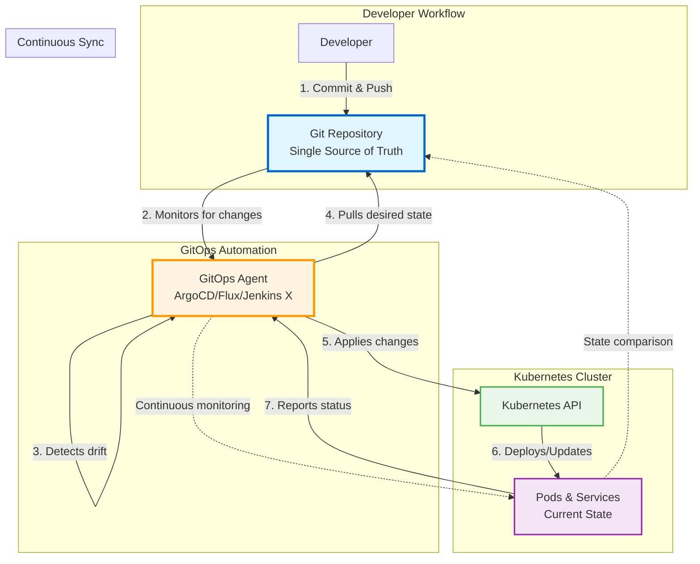

# Week 2 Reflection – GitOps with FluxCD

This week, I set up GitOps in my Kind Kubernetes cluster using [FluxCD](https://fluxcd.io/). I bootstrapped a new repository for this lab, called [Hello GitOps](https://github.com/rmiravalles/hello-gitops), which contains a simple FastAPI application that serves two different versions of the app, to simulate different environments (dev and prod).

---

## ✅ What I Learned

### What is GitOps?

GitOps is a deployment model that uses Git as the single source of truth for declarative infrastructure and applications. Changes to the desired state are made in Git, and automated processes ensure that the actual state in the cluster matches the desired state.

### Core principles of GitOps

1. Declarative Descriptions
2. Versioned and Immutable Storage
3. Automated Delivery
4. Automatic drift detection and correction

### Benefits of GitOps

- Improved collaboration and transparency
- Enhanced security and compliance
- Faster and more reliable deployments
- Faster recovery and rollbacks

### GitOps Pull-based model

In a pull-based model, the GitOps operator (like FluxCD) continuously monitors the Git repository for changes. When a change is detected, the operator pulls the new configuration and applies it to the cluster. This approach allows for better security and scalability, as the operator can run with limited permissions and does not require direct access to the cluster from external systems.



## The Exercise

For this exercise, I created a new Git repository called [Hello GitOps](https://github.com/rmiravalles/hello-gitops) and set up FluxCD to manage the deployment of a simple FastAPI application.

---

## ❓ What Was Challenging

-
- 
- 
- 


---

## 🧪 Commands I Practiced

```bash


```

---

## 🔁 GitOps Impact

- 
- 
- 
- 


---

## 📝 Questions I Still Have

- 
- 
- 
-

---

## 🚀 Looking Ahead

I’m curious to explore how GitOps handles secrets, multi-cluster environments, and policy-based validations using tools like SOPS, Kyverno, or Vault.

