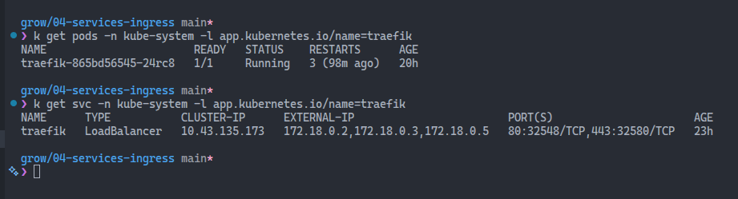
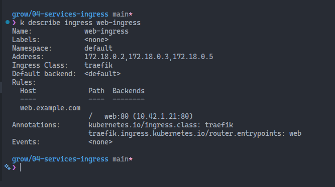

# Week 4 Reflection – Services and Ingress

In this week, I explored Kubernetes networking through Services and Ingress.  
Here are my reflections on what I learned, what challenged me, and how you might apply it.

---

## Services

In Kubernetes, a Service is like a stable address book entry for your application.

Services come into play to solve the following problem: Pods (the containers running your app) are temporary. They get created, destroyed, and replaced all the time, and each time they get a new IP address. If other parts of your application need to talk to these Pods, they'd constantly need to track these changing IP addresses, which would be a nightmare.A Service fixes this by providing a single, stable endpoint that doesn't change.

### How it works

When you create a Service, Kubernetes:

- Assigns it a stable IP address
- Automatically finds all the Pods that match certain labels
- Routes traffic to those Pods, spreading the load between them
- Updates the routing automatically when Pods come and go

### Simple example

Let's say you have 3 Pods running your web application. Instead of tracking all 3 Pod IPs, you create a Service. Now anyone who wants to reach your app just connects to the Service's single IP or DNS name, and Kubernetes automatically forwards the request to one of the healthy Pods.

It's essentially a built-in **load balancer with automatic service discovery** - two critical features you need when running applications in a dynamic environment like Kubernetes.

### Types of Services

- **ClusterIP**: The default type. Exposes the Service on a cluster-internal IP. Only accessible within the cluster.
- **NodePort**: Exposes the Service on a static port on each node's IP. Accessible from outside the cluster using `<NodeIP>:<NodePort>`.
- **LoadBalancer**: Provisions an external load balancer (if supported by the cloud provider) and assigns a public IP to the Service. Accessible from outside the cluster.

## Ingress

While Services expose your app internally within the cluster, Ingress is like a traffic cop that manages how external users access your services. It provides rules for routing external HTTP and HTTPS traffic to the right Service based on the request's host or path.

### How it works

When you set up an Ingress, you define rules that say things like:

- "If the request is for `web.example.com`, send it to the `web` Service."
- "If the request is for `api.example.com`, send it to the `api` Service."
- "You can also specify path-based routing, like sending requests to `web.example.com/v2` to a different Service."
- "Additionally, Ingress can handle SSL/TLS termination, meaning it can manage HTTPS connections and forward them as HTTP to your Services."

### Ingress Controllers

To make Ingress work, you need an Ingress Controller. This is a special type of load balancer that watches for Ingress resources and configures itself to route traffic according to the rules you defined. Popular Ingress Controllers include NGINX, Traefik, and HAProxy.

### Notes on the NGINX Ingress Controller retirement

Kubernetes SIG Network and the Security Response Committee have announced the upcoming retirement of the NGINX Ingress Controller. You can read more about this decision and its implications in the [official announcement](https://kubernetes.io/blog/2025/11/11/ingress-nginx-retirement/).

### Traefik as an alternative

Traefik is a popular alternative for managing Ingress in Kubernetes. Traefik offers dynamic configuration, built-in support for Let's Encrypt, and seamless integration with Kubernetes. It also provides features like path rewriting through Middlewares, which can be used to manipulate request paths as needed.

In K3s, Traefik is the default Ingress Controller, so if you're using K3s, you can take advantage of Traefik's features without needing to set up an additional Ingress Controller.


## ✅ Deploying the Pod and Service

For the exercise, I deployed a Pod running NGINX with the YAML file provided. The file can be found below, in the "Related Files" section.

Then, I created a Service of type ClusterIP to expose the Pod internally. This allows other components within the cluster to communicate with the web application without needing to know the specific IP address of the Pod.

To test the Service, I used `kubectl port-forward` to forward a local port to the Service's port. This way, I could access the web application running in the cluster from my local machine using `curl`. The commands I used were:

```bash
kubectl port-forward svc/web 8080:80
curl http://localhost:8080
```

## ✅ Deploying the Ingress

Since the NGINX Ingress Controller is being retired, I decided to deploy Traefik as my Ingress Controller for this exercise. K3D, which runs K3S under the hood, comes with Traefik pre-installed, so I didn't need to set it up separately.

Here, however, I hit a roadblock.

I adapted the provided `web-ingress.yaml` file by adding these lines to the `metadata.annotations` section:

```yaml
kubernetes.io/ingress.class: traefik
traefik.ingress.kubernetes.io/router.entrypoints: web
```

When I applied the Ingress resource, I got a warning message that said that the annotation `kubernetes.io/ingress.class` is deprecated in favor of the `spec.ingressClassName` field. The resource was created, though. I updated the `web-ingress.yaml` file to include the `ingressClassName` field, but I left the annotations there.

I updated the `/etc/hosts` file with the following command:

```bash
echo "127.0.0.1 web.example.com" | sudo tee -a /etc/hosts
```

It didn't work. A `curl http://web.example.com` command returned a "Couldn't connect to server" error.

### Troubleshooting

To troubleshoot, I first checked if the Traefik Pod was running with the command:

```bash
kubectl get pods -n kube-system -l app.kubernetes.io/name=traefik
```

The output showed that it was indeed running.

I then checked the Traefik service with:

```bash
kubectl get svc -n kube-system -l app.kubernetes.io/name=traefik
```

The output showed that there's a service named `traefik` of type `LoadBalancer`.



This is what I see when I describe the Ingress resource:

```bash
kubectl describe ingress web-ingress
```



I then added those IP addresses that I found in the `EXTERNAL-IP` column of the Traefik service to my `/etc/hosts` file, but it still didn't work.

Finally, I tried to access the Traefik dashboard by port-forwarding to the Traefik Pod:

```bash
kubectl port-forward -n kube-system $(kubectl get pods -n kube-system -l app.kubernetes.io/name=traefik -o name) 9000:9000
```
I was unable to connect to the dashboard at `http://localhost:9000/dashboard/`.

I still can't figure out where the problem is. I'll keep investigating and update this reflection when I find the solution.

---
### A complete change in direction

So, after a lot of attempts and dead-ends, I decided to go with the Kind solution. I had never used Kind before, so it's also a good chance to learn it.

This is the config file I used to spin-up my Kind cluster.

```yml
# kind-config.yaml
kind: Cluster
apiVersion: kind.x-k8s.io/v1alpha4
nodes:
  # Control plane node
  - role: control-plane
    kubeadmConfigPatches:
    - |
      kind: InitConfiguration
      nodeRegistration:
        kubeletExtraArgs:
          node-labels: "ingress-ready=true"
    extraPortMappings:
    - containerPort: 80
      hostPort: 80
      protocol: TCP
    - containerPort: 443
      hostPort: 443
      protocol: TCP
  
  # Worker node 1
  - role: worker
  
  # Worker node 2
  - role: worker
```


## ❓ What Was Challenging

- To check the available Ingress classes in the cluster, I had to run `kubectl get ingressclasses` and look for the `NAME` column. In my case, it was `traefik`.
- To check if Traefik is running: `kubectl get pods -n kube-system -l app.kubernetes.io/name=traefik`

---

## 🧪 Commands I Practiced

```bash

```

---

## 🌐 Concepts I Better Understand Now

- 

---

## 💡 How I Might Use This in the Real World

- 

---

## 📝 Questions I Still Have

- 

---

## 📎 Related Files

### web-pod.yaml

```yaml
apiVersion: v1
kind: Pod
metadata:
  name: web
  labels:
    app: web
spec:
  containers:
    - name: web
      image: nginx
      ports:
        - containerPort: 80
```

### web-service.yaml

```yaml
apiVersion: v1
kind: Service
metadata:
  name: web
spec:
  selector:
    app: web
  ports:
    - protocol: TCP
      port: 80
      targetPort: 80
  type: ClusterIP
```

### web-ingress.yaml

```yaml
apiVersion: networking.k8s.io/v1
kind: Ingress
metadata:
  name: web-ingress
  namespace: default
  annotations:
    # Specify Traefik as the ingress controller
    kubernetes.io/ingress.class: traefik
    traefik.ingress.kubernetes.io/router.entrypoints: web
spec:
  rules:
  - host: web.example.com
    http:
      paths:
      - path: /
        pathType: Prefix
        backend:
          service:
            name: web
            port:
              number: 80
```

---

## 🚀 What's Next

Try deploying a second app and routing it through the same Ingress controller using a different path like `/v2`.

Or submit your own Week 5 lab idea as a PR!