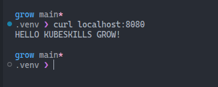
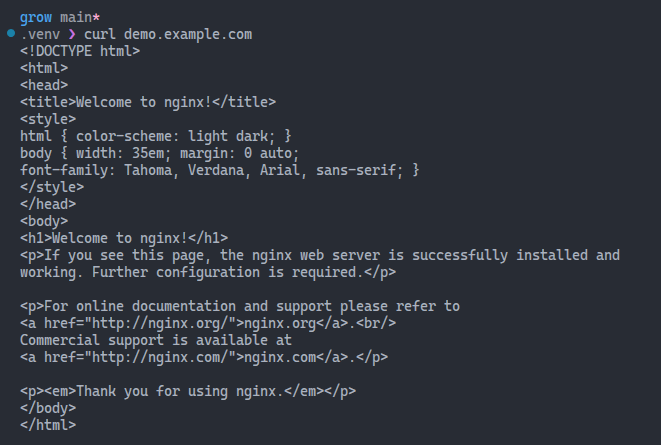

# Week 4 Reflection – Services and Ingress

In this week, I explored Kubernetes networking through Services and Ingress.  
Here are my reflections on what I learned, what challenged me, and how you might apply it.

---

## Services

In Kubernetes, a Service is like a stable address book entry for your application.

Services come into play to solve the following problem: Pods (the containers running your app) are temporary. They get created, destroyed, and replaced all the time, and each time they get a new IP address. If other parts of your application need to talk to these Pods, they'd constantly need to track these changing IP addresses, which would be a nightmare.A Service fixes this by providing a single, stable endpoint that doesn't change.

### How it works

When you create a Service, Kubernetes:

- Assigns it a stable IP address
- Automatically finds all the Pods that match certain labels
- Routes traffic to those Pods, spreading the load between them
- Updates the routing automatically when Pods come and go

### Simple example

Let's say you have 3 Pods running your web application. Instead of tracking all 3 Pod IPs, you create a Service. Now anyone who wants to reach your app just connects to the Service's single IP or DNS name, and Kubernetes automatically forwards the request to one of the healthy Pods.

It's essentially a built-in **load balancer with automatic service discovery** - two critical features you need when running applications in a dynamic environment like Kubernetes.

### Types of Services

#### ClusterIP

This exposes the Service on an internal IP within the cluster. It's only accessible from within the cluster itself. This is useful for internal communication between your Pods - for example, when your frontend needs to talk to your backend, or your application needs to reach a database.

#### NodePort

This exposes the Service on each Node's IP at a static port (the NodePort). It automatically creates a ClusterIP Service as well. You can then access the Service from outside the cluster by requesting `<NodeIP>:<NodePort>`. The port range is typically **30000-32767**. This is commonly used for development or when you need simple external access without a load balancer.

#### LoadBalancer

This exposes the Service externally using a cloud provider's load balancer (like AWS ELB, GCP Load Balancer, or Azure Load Balancer). It automatically creates NodePort and ClusterIP Services as well. This is the standard way to expose services to the internet in production cloud environments, as it provisions an actual external load balancer with a public IP.


## Ingress

An Ingress is a Kubernetes resource that defines rules for routing external `HTTP/HTTPS` traffic to Services inside your cluster. Think of it as a set of routing rules that say "if someone requests `myapp.com/api`, send them to the `API` Service" or "if someone requests `myapp.com/blog`, send them to the `blog` Service."

### Key features of Ingress:

- **Host-based routing**: Route traffic based on domain names (api.example.com vs app.example.com)
- **Path-based routing**: Route based on URL paths (/api, /admin, /shop)
- **TLS/SSL termination**: Handle HTTPS certificates in one place
- **Single entry point**: One external IP/LoadBalancer for multiple Services

### Ingress Controllers

An Ingress Controller is the actual implementation that reads your Ingress rules and makes them work. It's a Pod running in your cluster that acts as a reverse proxy and load balancer. Popular Ingress Controllers include **NGINX**, **Traefik**, and **HAProxy**.

> Unlike other Kubernetes resources, Ingress doesn't work automatically - you must install an Ingress Controller first, otherwise your Ingress rules just sit there doing nothing.

### Notes on the NGINX Ingress Controller retirement

Kubernetes SIG Network and the Security Response Committee have announced the upcoming retirement of the NGINX Ingress Controller. You can read more about this decision and its implications in the [official announcement](https://kubernetes.io/blog/2025/11/11/ingress-nginx-retirement/).

### Traefik as an alternative

Traefik is a popular alternative for managing Ingress in Kubernetes. Traefik offers dynamic configuration, built-in support for Let's Encrypt, and seamless integration with Kubernetes. It also provides features like path rewriting through Middlewares, which can be used to manipulate request paths as needed.


## ✅ Deploying the Pod and Service

For the exercise, I created a Deployment, instead of a single Pod. Here's the YAML manifest for the Deployment.

```yml
apiVersion: apps/v1
kind: Deployment
metadata:
  name: demo
spec:
  replicas: 1
  selector:
    matchLabels:
      app: demo
  template:
    metadata:
      labels:
        app: demo
    spec:
      containers:
      - name: nginx
        image: nginx:latest
        ports:
        - containerPort: 80
```

I then created a Service of type `ClusterIP`.

```yml
apiVersion: v1
kind: Service
metadata:
  name: demo
spec:
  ports:
  - port: 80
    targetPort: 80
  selector:
    app: demo
  type: ClusterIP
```

To test the Service, I used `kubectl port-forward` to forward a local port to the Service's port. This way, I could access the web application running in the cluster from my local machine using `curl`. The commands I used were:

```bash
kubectl port-forward svc/web 8080:80
curl localhost:8080
```



I made a tiny change to the `index.html` file here.

## ✅ Deploying the Ingress Controller

Since the NGINX Ingress Controller is being retired, I decided to deploy Traefik as my Ingress Controller for this exercise. And here is where I ran into a lot of issues. I'll do my best to explain the root causes and the changes I made to fix them.

### Deploying the Traefik Ingress controller using Helm

To use another cool tool, I decided to use Helm to deploy the Traefik Ingress Controller. This is how I did it.

#### Adding the Traefik Helm repository.

```bash
helm repo add traefik https://traefik.github.io/charts
helm repo update
```

#### Installing Traefik

I didn't go too deep here, and I ended up with an installation that didn't work. This is the first installation command I ran:

```bash
helm install traefik traefik/traefik \
  --namespace traefik \
  --create-namespace \
  --set ports.web.nodePort=30080 \
  --set ports.websecure.nodePort=30443
```

It all looked good at first. The Traefik Pod was running, and the Service was created. However, when I tried to access the host `demo.example.com`, I got the error below.

```bash
curl: (56) Recv failure: Connection reset by peer
```

It took me time to figure out this error, because apparently, everything looked good.

The first problem here was that the Traefik Pod was scheduled on a worker node instead of the control-plane node. In my Kind cluster, only the control-plane node has the `extraPortMappings` configured. This is my Kind cluster configuration file.

```yml
kind: Cluster
apiVersion: kind.x-k8s.io/v1alpha4
nodes:
  # Control plane node
  - role: control-plane
    kubeadmConfigPatches:
    - |
      kind: InitConfiguration
      nodeRegistration:
        kubeletExtraArgs:
          node-labels: "ingress-ready=true"
    extraPortMappings:
    - containerPort: 80
      hostPort: 80
      protocol: TCP
    - containerPort: 443
      hostPort: 443
      protocol: TCP
  
  # Worker node 1
  - role: worker
  
  # Worker node 2
  - role: worker
```

I guess I could add these `extraPortMappings` to the worker nodes as well. This is something to be investigated.

I created a `traefik-values.yaml`, like so:

```yml
service:
  type: ClusterIP

ports:
  web:
    exposedPort: 80
    hostPort: 80
  websecure:
    exposedPort: 443
    hostPort: 443

# Schedule Traefik on the control-plane node
nodeSelector:
  ingress-ready: "true"

# Allow scheduling on control-plane (has NoSchedule taint)
tolerations:
  - key: node-role.kubernetes.io/control-plane
    operator: Equal
    effect: NoSchedule
  - key: node-role.kubernetes.io/master
    operator: Equal
    effect: NoSchedule
```

To allow scheduling Traefik on the control-plane node, I added a `nodeSelector` that matches the label `ingress-ready=true`. This label was added to the control-plane node in the Kind configuration file. The `tolerations` section allows Traefik to be scheduled on the control-plane node, which has a `NoSchedule` taint by default.

This is something you should be aware of when working with multi-node clusters. This happened to me before, when experimenting with K3D some time ago. If you simply deploy the workloads without specifically targeting the node you want, you might end up with workloads running on nodes that don't have the necessary configurations. So, always pay attention to it, and rely on `nodeSelector` and `tolerations` to ensure your workloads are scheduled on the right nodes.

To update the Traefik installation with the new values file, I ran the following command:

```bash
helm upgrade traefik traefik/traefik \
  --namespace traefik \
  --values traefik-values.yaml
```

### The Traefik Service

The second problem was that the Traefik Service was of type `LoadBalancer`. I didn't define it anywhere. It was deployed like that by default, I suppose. I had to change it to `ClusterIP`.

## What is hostPort?

In the Traefik Pod port configuration, I added `hostPort` to expose the necessary ports on the control-plane node's network interface.

Take a look at this snippet.

```yml
ports:
  web:
    exposedPort: 80
    hostPort: 80
  websecure:
    exposedPort: 443
    hostPort: 443
```

### HTTP Entry Point (web)

| Parameter | Description |
|-----------|-------------|
| `web` | Traefik's name for the HTTP entry point. |
| `exposedPort: 80` | The port inside the Traefik container where it listens for HTTP traffic.<br>This is the container-level port that Traefik binds to.<br>Applications inside the cluster use this port to reach Traefik. |
| `hostPort: 80` | Binds the container's port directly to the node's network interface on port 80.<br>This makes port 80 on the host node forward traffic to port 80 in the Traefik pod.<br>Bypasses Kubernetes Service networking - traffic goes straight from node → pod. |

### HTTPS Entry Point (websecure)

| Parameter | Description |
|-----------|-------------|
| `websecure` | Traefik's name for the HTTPS entry point. |
| `exposedPort: 443` | Container listens on port 443 for HTTPS traffic. |
| `hostPort: 443` | Binds to port 443 on the host node. |

### How hostPort Works

The `hostPort` creates a direct binding from the Node's network stack to the Pod.

```
Traffic Flow:
localhost:80 
  → Kind extraPortMappings (forwards to control-plane node)
    → Node's port 80 (hostPort binding)
      → Traefik pod's port 80 (exposedPort)
        → Backend services
``` 

## Deploying the Ingress Resource

After deploying Traefik, I created an Ingress resource to route traffic to the `demo` Service. Here's the YAML manifest for the Ingress.

```yml
apiVersion: networking.k8s.io/v1
kind: Ingress
metadata:
  name: demo-ingress
spec:
  ingressClassName: traefik
  rules:
    - host: demo.example.com
      http:
        paths:
          - path: /
            pathType: Prefix
            backend:
              service:
                name: demo
                port:
                  number: 80
```

The file you see above was updated. When I applied the Ingress resource, according to the one in the lab, I got a warning message that said that the annotation `kubernetes.io/ingress.class` is deprecated in favor of the `spec.ingressClassName` field. The resource was created, though. I updated the `web-ingress.yaml` file to include the `ingressClassName` field.

I updated the `/etc/hosts` file with the following command:

```bash
echo "127.0.0.1 web.example.com" | sudo tee -a /etc/hosts
```

### cURL success!

Now I can finally cURL the host `demo.example.com` and get a successful response.

```bashbash
curl demo.example.com
```



It took me a while to get here, but it was worth it. I learned a lot about how Ingress works, and how to troubleshoot issues with Ingress controllers. I also got to experiment with Traefik, which is a great alternative to NGINX.

It was a very exciting journey!